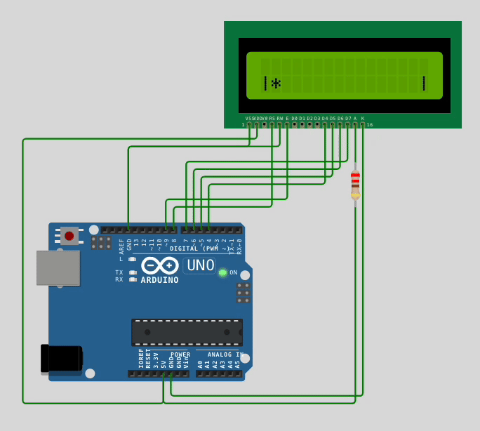

# rowguelike

```"Just because you can, doesn’t mean you should"```

## 📟 The Game Engine for small LCD text screens. "As not seen on TV"
   
[](https://www.ardu-badge.com/rowguelike)



**Targets:** Arduino, \*nix Terminal  
**Version:** 0.0.3
  


  
Available as Arduino library or Platform.io library
  
## 👾 Getting started

The game is defined by a set of 'Actors'
- Create an actor builder from the Engine singleton, optionally providing flags:  

    ```Engine::get().make(Actor::Move | Actor::Control) ```
- Continue with custom values for Actor's Components:  

    ``` .text("Text").position(3,0) ```
- Call ```spawn()``` to make an instance of Actor from ActorBuilder

Full example:

```c++
using namespace rwe;

Engine::get().make()
	.text("Hello world")
	.position(0,0)
	.tag(1)
	.timer(10, TIMER_FN{
                        auto id = Engine::get().getActorByTag(1);
			auto p = Engine::get().getPosition(id);

			Engine.get().make()
				.position(p)
				.speed(1,0)
				.spawn();
		})
	.spawn();


```

## 💻 API

*“Give it to an LLM. It might not help, but it’ll sound confident.”*

```c++
using namespace rwe;

// Component classes
struct Components::Position { int8_t x,y,lookAt };
struct Components::Speed { int8_t vx,vy,rotation };
struct Components::Collider { int8_t value; ColliderFn colliderFn };
struct Components::Input { InputFn inputFn };
struct Components::Text { const char *line[2] };
struct Components::Timer { uint8_t currentFrame, frameCount; TimerFn fn };

// Engine getters:
Components::Position & Engine::getPosition(EntityId id) { return components.position[id]; }
Components::Speed & Engine::getSpeed(EntityId id) { return components.speed[id]; }
Components::Hitpoints & Engine::getHitpoints(EntityId id) { return components.hitpoints[id]; }

Components::Collider & Engine::getCollider(EntityId id) { return components.collider[id]; }
Components::Text & Engine::getText(EntityId id) { return components.text[id]; }
Components::Input & Engine::getInput(EntityId id) { return components.input[id]; }
Components::Timer & Engine::getTimer(EntityId id) { return components.timer[id]; }

// Input class
struct RawInput { bool left, right, up, down, select; };

// Actor::* is an ActorFlag

// make() accepts optional ActorFlags (bitmask) and returns ActionBuilder
// the final method for ActionBuilder is spawn()
Engine::get().make(); 

// Or use a shorthand for an actor without flags
#define RW_ACTOR ::rwe::Engine::get().make()

// Use remove() to de-spawn actor:
Engine::remove(EntityId);

// Render text at position
ActorFlags Actor::Text;		
ActorBuilder& ActorBuilder::text(const char* t);
// Add line
ActorBuilder& ActorBuilder::textLine(const uint8_t line, const char *l0)

// Use speed at each frame to change position
ActorFlags Actor::Move;		
ActorBuilder& ActorBuilder::position(int8_t x, int8_t y)
ActorBuilder& ActorBuilder::speed(int8_t vx, int8_t vy)

// The actor is directly moved by input values
ActorFlags Actor::Control;	

// Checks hitpoints value and removes actor if HP==0
ActorFlags Actor::Health;	
ActorBuilder& ActorBuilder::hitpoints(int8_t hp)

// Performs collision check / action function with this actor
ActorFlags Actor::Collider; 
ActorBuilder& ActorBuilder::collider(int8_t value, ColliderFn fn)

// Runs input handler function
ActorFlags Actor::Input;	
ActorBuilder& ActorBuilder::input(InputFn fn)

// Runs timer each N frames
ActorFlags Actor::Timer; 	
ActorBuilder& ActorBuilder::timer(uint8_t count, TimerFn fn)

// Runs timer (same Component) each frame
ActorBuilder& ActorBuilder::eachFrame(TimerFn fn)

// Spawn from ActorBuilder:
Optional<EntityId> ActorBuilder::spawn() const;
void ActorBuilder::spawnToId(EntityId &id)

// Function types
using ColliderFn = void (*)(const EntityId &receiver, const EntityId peer);
using InputFn = void (*)(const EntityId &receiver, const RawInput &input);
using TimerFn = void (*)(const EntityId &receiver);

// Macros to define lambdas like MACRO_NAME_FN { ... }
#define COLLIDER_FN +[](const EntityId &receiver, const EntityId peer)
#define INPUT_FN +[](const EntityId &receiver, const RawInput &rawInput)
#define TIMER_FN +[](const EntityId &receiver)

/// macro for non-capturing void(void) lambda
#define FN +[]()

// Use 'if (TEST_HIT) {}' inside COLLIDER_FN
#define TEST_HIT TestHit(receiver, peer)

// NB: The frame is NOT cleared by the engine so you would probably need an Actor for the background

// Pre-built ActorsBuilders in 'A' namespace:
Engine::ActorBuilder A::Background(const char symbol = ' ')// Fills screen with spaces
Engine::ActorBuilder A::PlayerChar(const char *c = "#")    // Movable player displayed as char

// Accessing Actors
// NB: store a custom reference on Actor construction like ... .make().tag(10) to reuse it later
// NB: this will silently return a dummy value if id is not available
void Engine::setTag(EntityId id, Tag tag)
Actor & Engine::getActorByTag(const Tag tag)

// Get Actor by entity id
Actor & Engine::getActor(EntityId id)

// Custom draw commands
// This is used byt Text system so may not be needed directly:
void DrawContext::addText(int8_t x, int8_t y, const char *txt);

// alternative to A::Background Actor
void DrawContext::clearAll();

// Drawing custom characters:
struct CustomCharacter { uint8_t data[8] };
void DrawContext::defineChar(uint8_t idx, const CustomCharacter c);
void DrawContext::addChar(int8_t x, int8_t y, const uint8_t id);

/// NB: must be set by 'frontend', i.e. is '8' for Arduino LiquidCrystal library
uint8_t DrawContext::customCharacters;

// Shared data
struct SharedData
{
    union Element {
        uint8_t uint8[4];
        int8_t int8[4];
        uint16_t uint16[2];
        int16_t int16[2];
        int32_t uint32;
        int32_t int32;
        void* ptr;
    };
    const char *constStrings[Setup::SharedStrings];
    
    // NB: no direct access to elements array here
    
    Element getElement(int index) const;
    void setElement(int index, const Element &in);
};
SharedData Engine::sharedData;

// Pages handling
// PageManager singleton
// Max page count is set by Setup::PageCount / macros
void PageManager::setPage(uint8_t idx, PageFn fn)
void PageManager::switchPage(uint8_t idx) 

// helper macros
SET_PAGE(index, /* function body */)
SWITCH_PAGE(index)

// Other macros
#define RWE Engine::get() // Engine singleton

```

---
Arduino is a registered trademark of its respective owners. This project is not affiliated with or endorsed by Arduino.
